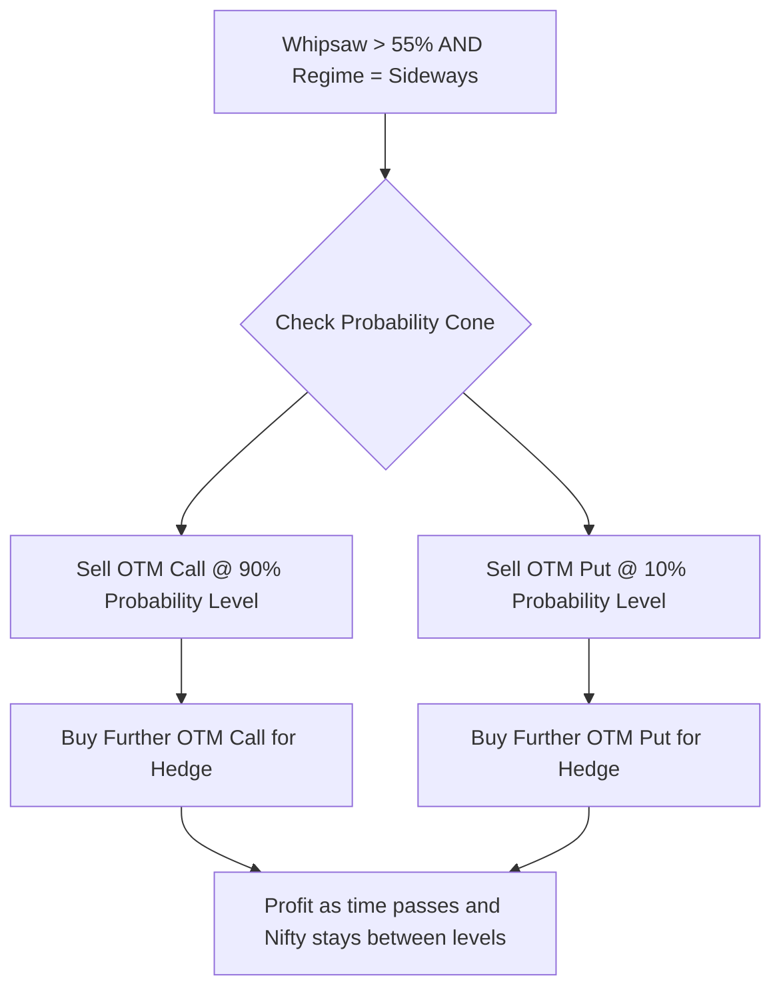
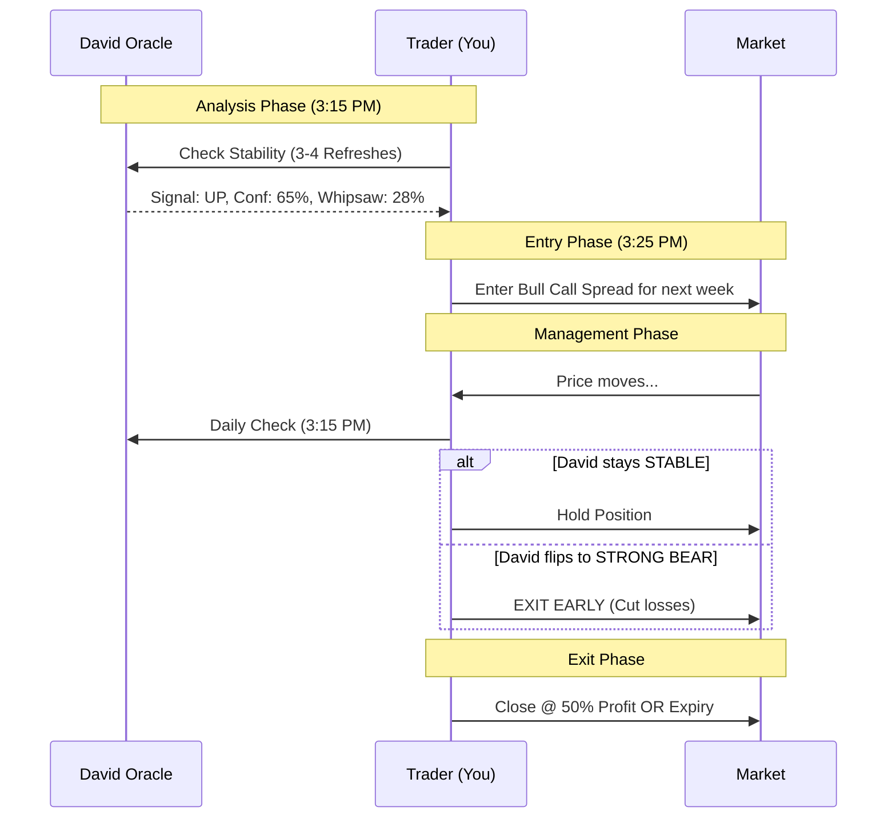

# 📊 David Oracle: Trading Guide for Retail Traders

This guide explains how to decipher the outputs of **David Prophet Oracle v1.0** and take high-probability trades.

---

## 👶 ELI5: How David Works

Think of David as a team of 3 market-expert kids (XGBoost, LightGBM, CatBoost) and an Elder (HMM).

- **Verdict (UP / DOWN / SIDEWAY)**: The 3 kids look at 45 different signals (RSI, VIX, S&P 500, etc.) and vote. If they think Nifty will move more than **0.3%** in the next 5 days, they yell "UP" or "DOWN".
- **Whipsaw (Chop)**: Is the sea too wavy? David checks if the price is flipping back and forth like a pancake. If **Whipsaw > 55%**, it's like a washing machine—you might get dizzy (lose money) if you bet on a single direction.
- **Price Forecast (Probability Cone)**: Like a weather report. "The temperature will likely be between 24°C and 28°C." These bands show where Nifty is **80% likely** to stay.
- **Bounce Probability**: This is the "History Repeats" button. David looks back at 10 years of data. If Nifty drops to your target, he counts how many times it bounced back from there in the past.

---

---

## 🎯 The Strategy Matrix (Master Cheat Sheet)

Use this table to match David's output to the professional option structure that fits the probability.

| Scenario | Verdict | Conf. | Whipsaw | Strategy | Example Case (Nifty at 24,500) |
| :--- | :--- | :--- | :--- | :--- | :--- |
| **Clear Trend** | UP/DOWN | >60% | <35% | **Bull/Bear Spread** | **UP**: Buy 24500 CE + Sell 24700 CE. (Captures move with protection). |
| **Messy Trend** | UP/DOWN | >60% | >45% | **Straddle / Strangle** | David is sure about direction but the road is bumpy. Buy both CE/PE. |
| **Dead Market** | SIDEWAYS | Any | >60% | **Iron Condor** | Sell OTM Put + Sell OTM Call. Stay outside David's 80% Cone. |
| **Bottoming** | SIDEWAYS | Any | <35% | **Bull Put Spread** | Selling insurance at the bottom. Sell 24200 PE + Buy 24000 PE. |
| **Weak Signal** | Any | <45% | Any | **Cash is King** | David is unsure. High probability of losing money to Theta. **Stay Out.** |

### 💡 Strategy Use Cases:
- **Bull/Bear Spreads**: Use these when David is "Locked In" (>60% Conf). They protect you from a localized 50-point crash while you wait for the 5-day UP move.
- **Iron Condors**: Use these when Whipsaw is high and the "Regime" is Sideways. This is your "Income" strategy.
- **Straddles**: Use these ONLY when David says a move is coming (High Conf) but the "Whipsaw" is high. It means the market is about to explode, but we don't know if it will "Shake the Tree" first.

---

---

## ⚠️ Understanding "Whipsaw" (The Noise Filter)

David's "Whipsaw" indicator is a **Noise Filter**. It tells you if the current market "Move" is a solid trend or just a random wiggle.

| Whipsaw % | Meaning | Interpretation | Action |
|:---|:---|:---|:---|
| **0% - 35%** | **TRENDING** | Very "Clean" movement. No fakeouts. | **High Confidence**. Go heavy on directional bets. |
| **35% - 55%** | **NEUTRAL** | Bumpy road. Potential for small reversals. | Reduce position size. Use wider stop-losses. |
| **> 55%** | **CHOPPY** | "Washing Machine". Sideways death trap. | **STOP**. Avoid Puts/Calls. Only play Iron Condors. |

---

## 🔮 Deciphering "AI Confidence"

David’s Confidence is the "agreement" between his 3 AI kids. Since there are 3 choices (UP/DOWN/SIDEWAYS), the math starts at **33.3%** (random flip of a coin).

| Confidence | Signal Strength | Reality Check | Action |
|:---|:---|:---|:---|
| **< 40%** | **WEAK** | David is lost. Models are fighting. | **STAY OUT**. High risk of reversal. |
| **40% - 55%** | **MODERATE** | A favorite has emerged, but it's not a slam dunk. | Pair with **Whipsaw** signal. Small size only. |
| **55% - 70%** | **STRONG** | High agreement across models. | **ACTIONABLE**. Good for spreads. |
| **> 70%** | **EXTREME** | Very rare conviction. | **GOLDEN ZONE**. Highest probability of success. |

### How to use Confidence with Whipsaw:
The best trades have **High Confidence (>60%)** AND **Low Whipsaw (<35%)**. 
- If confidence is high but whipsaw is also high, the move will be "violently messy"—you might be right about the direction but get stopped out by a sudden spike.

### Why your 25% Whipsaw is a "Green Light":
If David says **UP** and the Whipsaw is at **25%**:
- It means the "kids" (AI models) see a very straight path.
- There are **low candle flips** and low volatility spikes.
- David believes that if Nifty starts moving UP, it won't keep snapping back to hit your stop-loss. This is the **safest environment** for directional trades.

---

## 📉 Price Forecast & Ranges

The **Probability Cone** is your best friend for risk management.
- **Low (10%)**: The "Floor". If Nifty touches this, it's usually a "Touch and Bounce" zone.
- **High (90%)**: The "Ceiling". If reached, expect profit-taking.
- **Median (50%)**: The most likely Magnet. Price usually vibrates around the median over several days.

---

## ⏰ Best Timing for Analysis

David is built on **Daily Data**. It expects "Finished Days" to make the most accurate predictions.

- **Best Time**: **3:15 PM – 3:30 PM IST** (Pre-close). This is when the day's candle is 99% complete, and the AI's math is most representative of the final result.
- **Intraday (8:45 AM – 3:15 PM)**: David is "guessing" based on work-in-progress data. Use with caution.
- **Data Source**: This system uses **Daily Candles** for its high-level prediction. Intraday 15-minute data is only used to "refresh" the latest spot price for a live look.

---

## 🧠 The Intraday "Confidence Flips"

You might notice the **Confidence Gauge** moves every time you hit Sync. This is normal and happens for three reasons:

1. **The Butterfly Effect**: David calculates **45 hidden features** (RSI, Moving Averages, etc.). A tiny 10-point move in Nifty changes all 45 numbers simultaneously, causing a chain reaction in the AI's brain.
2. **The "New Reality"**: The AI has no memory of the past 15 minutes. Every refresh is a "Brand New World" to David.
3. **Work in Progress**: At 10:00 AM, Nifty has 0% volume compared to a full day. David sees "Low Volume" and might think the market is weak, even if it's just early.

### 🌟 The Golden Rule of Stability
- **✅ Trust STABLE Confidence**: If Confidence stays >60% across 3 or 4 refreshes during the day, that is a **Strong Signal**.
- **❌ Ignore FLASHING Confidence**: If it jumps from 65% UP to 52% SIDEWAYS to 58% UP, that is just **Market Noise**. Stay out!

---

---

## 📈 Strategy Deep Dive: Professional Execution

### 1. The Short Iron Condor (Sideways/Income)
**Objective**: Profit from time decay (Theta) when Nifty stays in a range.

- **Selection**: Look at David's **80% Probability Cone**.
- **The Wings**: Sell strikes at the edges (10% and 90% lines). Buy strikes 100-200 points further out to cap risk.
- **Theta is King**: Best taken on **Monday/Tuesday** for the weekly expiry.

### 2. Bull/Bear Spreads (Directional Conviction)
**Objective**: Capture a 5-day move with a "Cushion" for safety.

- **Entry**: Only when **Confidence > 60%** and **Whipsaw < 35%**.
- **Structure (Bull)**: Buy 1 At-the-Money (ATM) Call + Sell 1 Out-of-the-Money (OTM) Call.
- **Structure (Bear)**: Buy 1 ATM Put + Sell 1 OTM Put.
- **Why?**: If David says "UP" but the market wiggles down 50 points first, your "Sold" option loses value faster than your "Bought" one, protecting your capital.

---

## 🔄 The Trade Lifecycle (Rules of Engagement)

### 📋 Rules to Live By:
1.  **Entry Window**: 3:15 PM – 3:28 PM IST. Never enter in the morning "Noise."
2.  **Profit Target**: 50% of maximum possible profit. Don't be greedy.
3.  **Stop Loss**: If David flips **strongly** against you (e.g., UP flips to >60% DOWN) and stays there for 2 refreshes.

---

## 🧠 Trading Psychology: Managing "The Machine"

### What to do if David is "Wrong"?
Predictions are probabilities, not promises. Even at 70% confidence, David will be **wrong 3 out of 10 times**.

**1. Convince Yourself with Data, Not Ego:**
When a trade goes red, don't say "The AI is stupid." Instead, check the data:
- Is the **Whipsaw** spiking? (If yes, the market is being irrational/noisy).
- Is the **S&P 500** crashing? (David might have missed a global black swan).
- Did the **Confidence** drop? (If yes, David is admitting he's less sure now).

**2. Building Systematic Conviction:**
- **The Law of 100 Trades**: Don't judge the system on one trade. Judge it on 100. If David is right 65% of the time over 100 trades, you will be very wealthy—even if you lose the next 3 in a row.
- **Systematic vs. Emotional**: If you manualy "override" David because you're scared, and David turns out to be right, you've lost more than money—you've lost your process. **Trust the math over the mood.**

**3. The "Wrong" Checklist:**
If it shows UP but goes DOWN:
- [ ] Check if the **Regime** changed.
- [ ] Check if **VIX** spiked > 10% (Panic).
- [ ] If rules are met, **EXIT**. No "Hoping." No "Waiting."

---

## 🛡️ Pro-Tips for "War Time" (High VIX > 18)
1. **Widen Your Wings**: High VIX means price moves 2x faster. Give your trades more room to breathe.
2. **Probability is Key**: In war time, "Confidence" becomes more important. Never take an "UP" signal if confidence is below 55% while VIX is high.
3. **Firefight Level**: Always check the **Iron Condor Analyzer**. It tells you exactly where to start "hedging" or closing your trade before it turns into a big loss.

> **Disclaimer**: David is an AI advisor, not a genie. Always manage your risk and never bet more than you can afford to lose.
